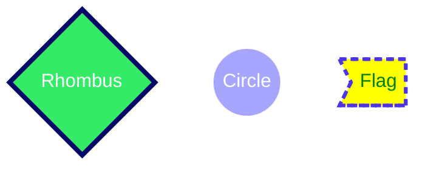

# Mermaid
Diagrams using Markdown files with Mermaid 
 
 
 
Example taken from: https://github.blog/2022-02-14-include-diagrams-markdown-files-mermaid/
 
Styling and Classes https://mermaid-js.github.io/mermaid/#/flowchart?id=styling-and-classes
 
Themes https://mermaid-js.github.io/mermaid/#/theming
 

