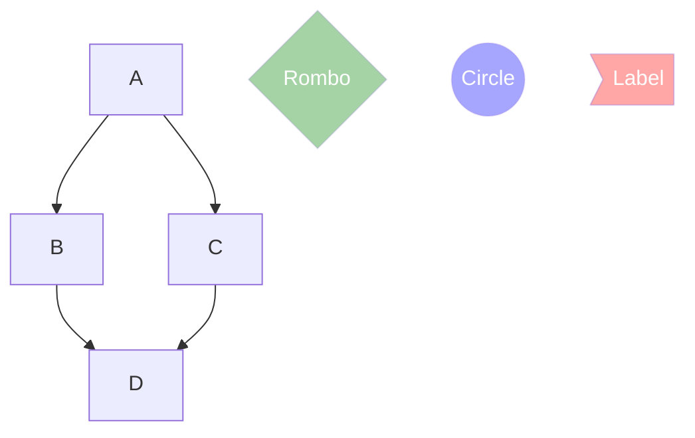

# Mermaid
Diagrams using Markdown files with Mermaid 
 
 
 
Example taken from: https://github.blog/2022-02-14-include-diagrams-markdown-files-mermaid/
 

```mermaid
  graph TD;
      A-->B;
      A-->C;
      B-->D;
      C-->D;
      st{Rombo};
      good((Circle));
      en>Label];
      style en fill:red,fill-opacity:0.35,color:#FFFFFF,stroke-opacity:0.2;
      style good fill:blue,fill-opacity:0.35,color:#FFFFFF,stroke-opacity:0.2;
      style st fill:green,fill-opacity:0.35,color:#FFFFFF,stroke-opacity:0.2;
      
```

